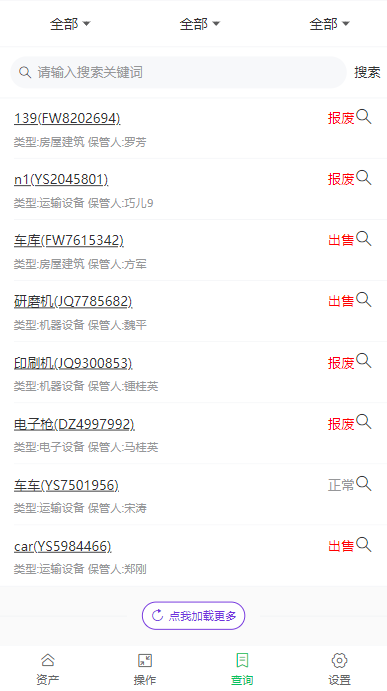
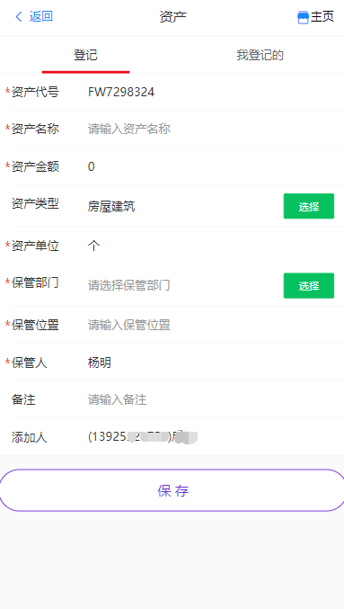

# 资产管理

主要功能: 资产登记 资产转移 资产报废 资产出售等等

手机在线体验(国外主机 慢 耐心)   

https://capitalvue.netlify.com   

# 技术栈：

##### 前端:

vue2.6

vant

vue-router

vuex 

vuex-persistedstate

echarts

##### 后端:

Bmob后端云 

# 功能预览：

 

 

 

 

